# CREAM ICE
## Cream Ice web application using Spring Boot and Angular 8

 - First, install JDK 11:
From you local computer, open any browser and navigate to the URL: https://www.oracle.com/java/technologies/javase-jdk11-downloads.html

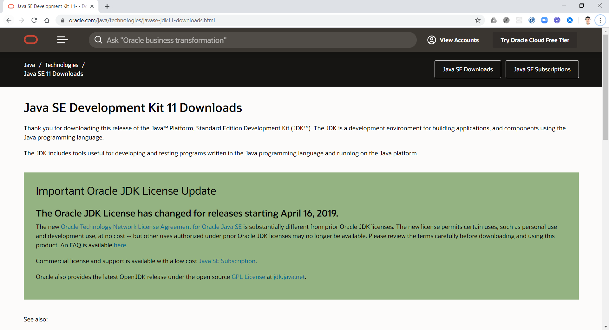

Scroll down and select Windows x64 Installer to download JDK 11 for Windows if you're using a Windows-based operating system machine or select other installers accordingly for other operating systems:

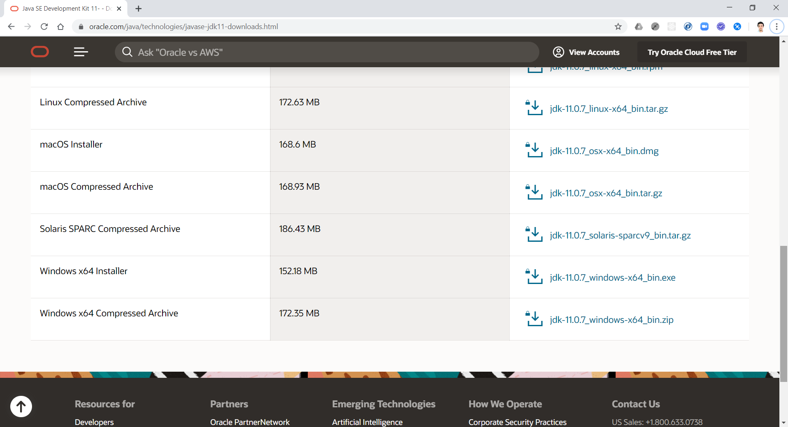

Next step is to install NodeJS: from your browser navigate to the URL: https://nodejs.org/en/

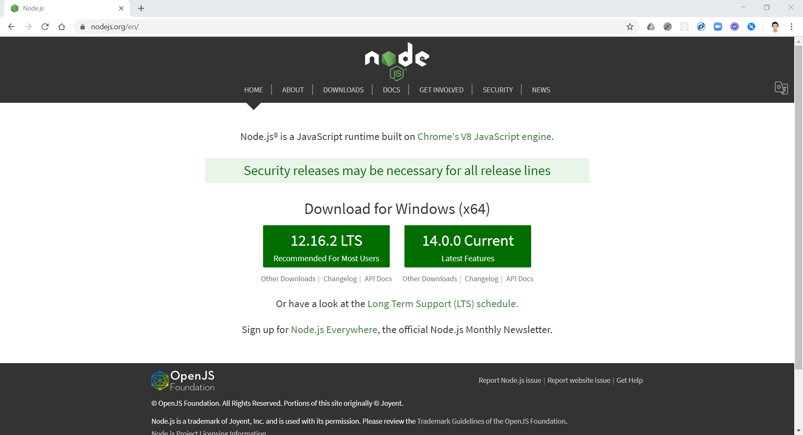

At the time reading this README.md file, when you go to NodeJS's home page the NodeJS versions available for download can be different but select the option with "LTS" in the ending which stands for "Long Time Support" and that means that it is a stable release and is going to be supported for a long term ahead in the future. NodeJS is required for running Angular applications and the Angular CLI which is a command line interface tool for developing Angular applications.

Next step is to install the Angular CLI: navigate to https://cli.angular.io/

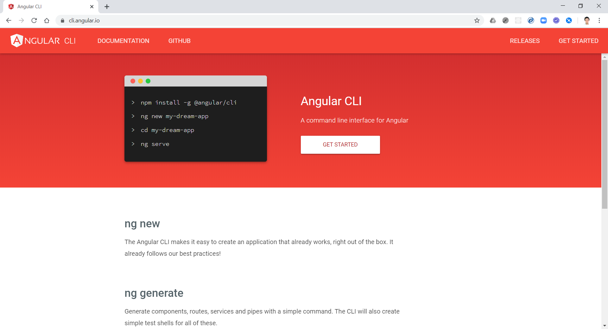

After having NodeJS installed on your machine, open the Command Prompt and type in the command: "npm install -g @angular/cli" to install Angular CLI.

Next step is to install MySQL Database Management System: navigate to https://dev.mysql.com/downloads/installer/ 

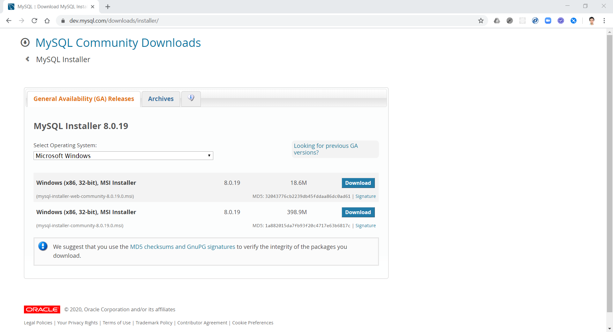

Select the bottom item to download and install MySQL Database Manage System into your local machine.

Next, navigate to https://spring.io/tools to install Spring Tool Suite IDE to run Java back-end code:

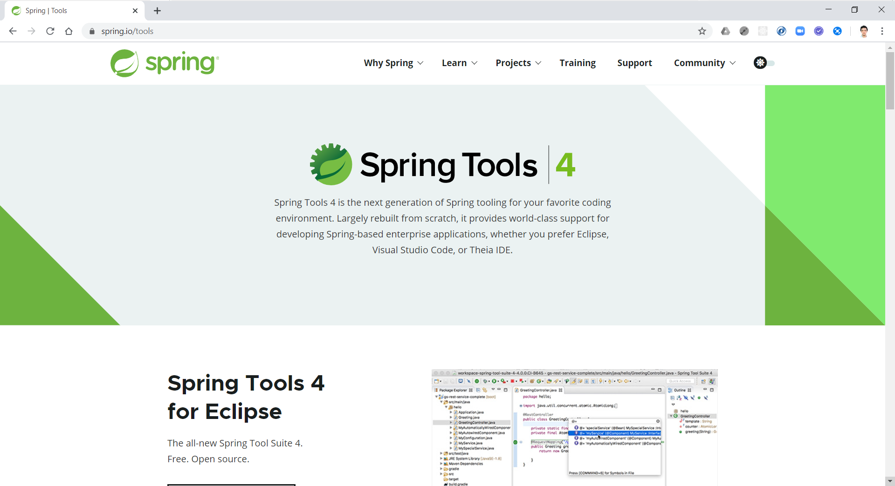

Select the installer according to your machine's operating system:

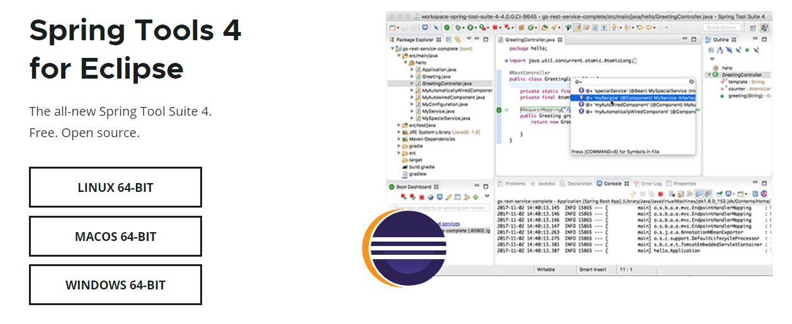

Last thing is to download and install Visual Studio Code to run the front-end code: 

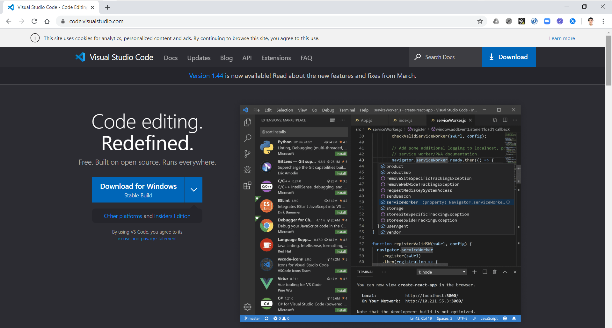

After all the tools have been installed on your local machine, first, start MySQL Workbench and import the database into MySQL Workbench by running the CreamIceDatabase.sql script: 

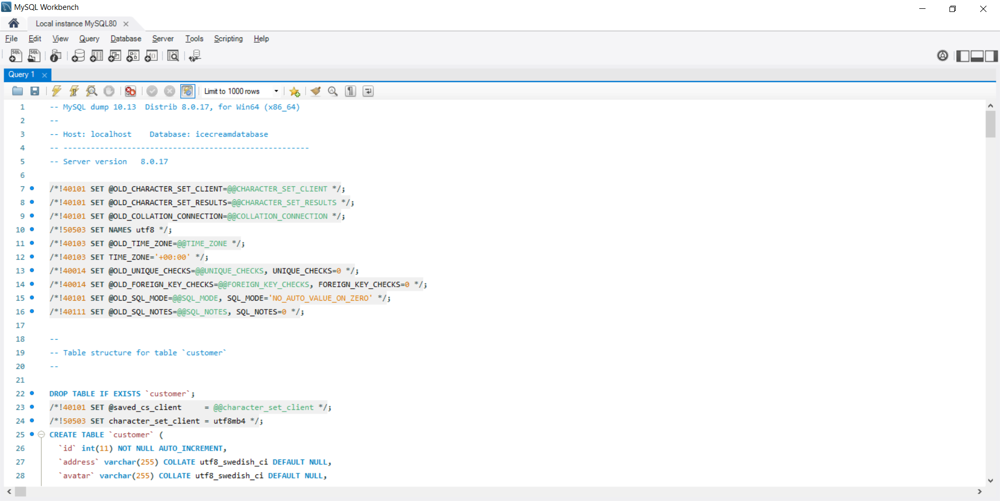

Next, start Spring Tool Suite and import the back-end code: 

Select File -> Import...

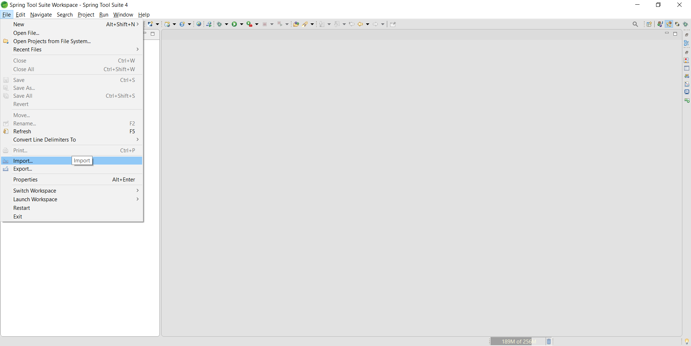

Select Maven -> Existing Maven Projects -> Next

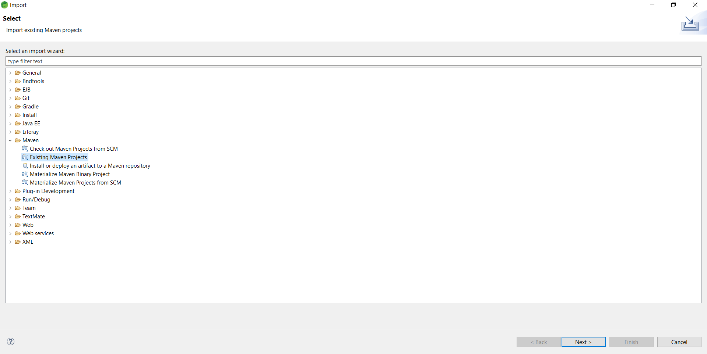

Browse to project directory on your local machine where the Maven's pom.xml file is located:

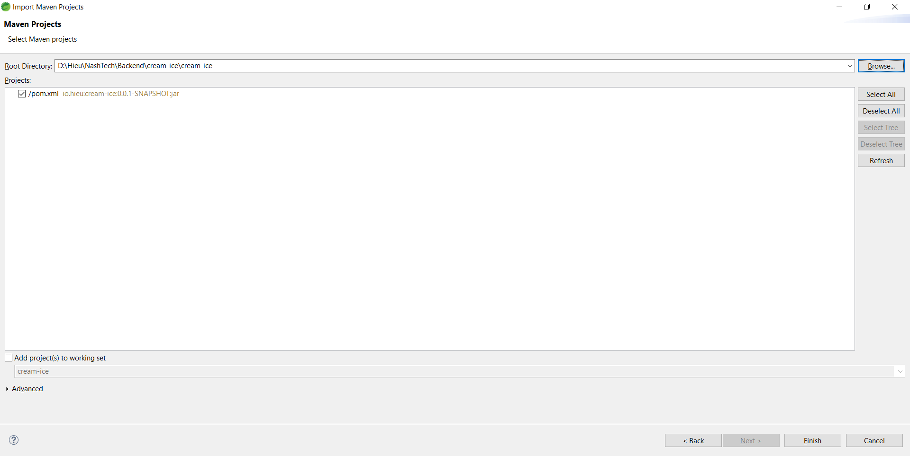

Select Finish. Backend project code will be imported into Spring Tool Suite and is ready to be run. In Project Explorer, navigate to src/main/resource -> application.properties file:

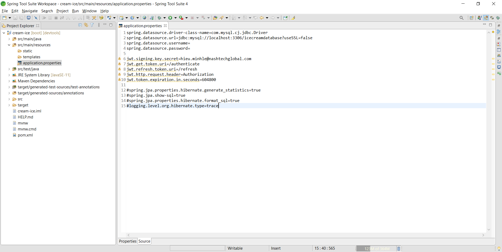

Enter your MySQL's local instance username and password on line 3 and 4 then right-click on project title -> Run As -> Spring Boot App.

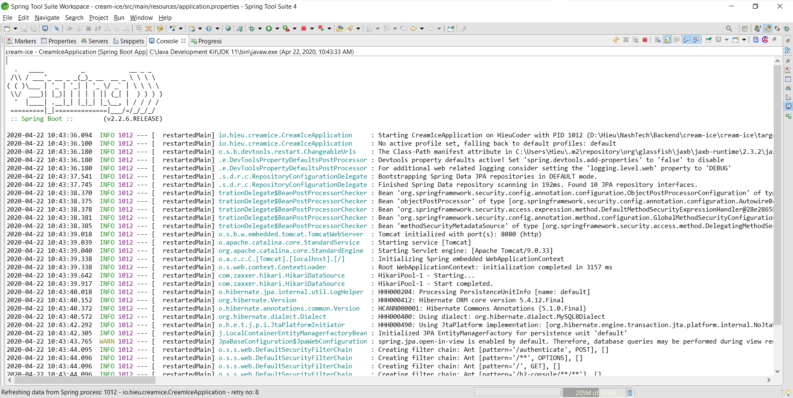

Java back-end code is started up and running!

Next, open Visual Studio Code, select Open Folder and Navigate to where the frontend project code is located:

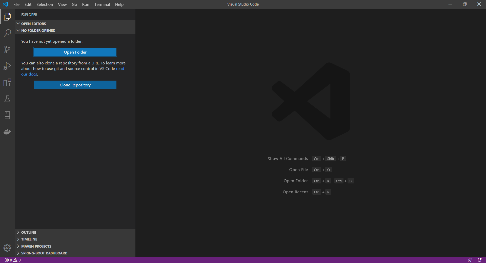

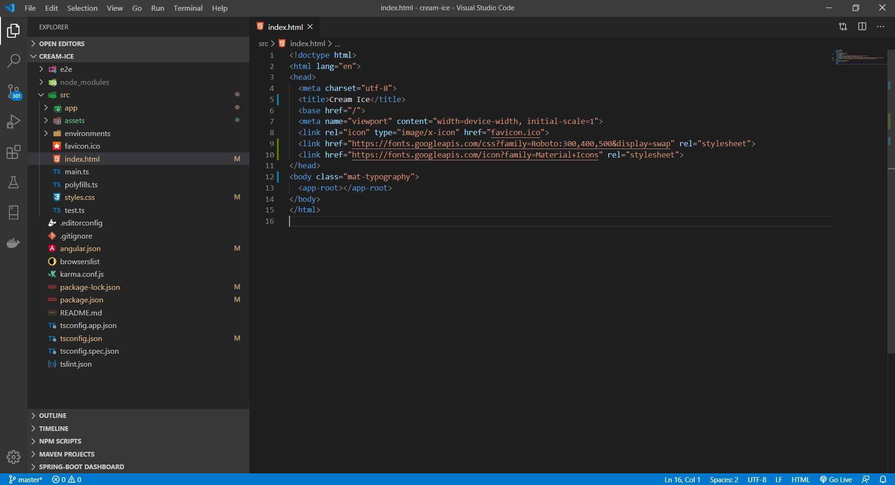

After frontend code is opened in Visual Studio Code, press Ctrl + ` to open the terminal and enter the command: "ng serve" to start the Angular application:

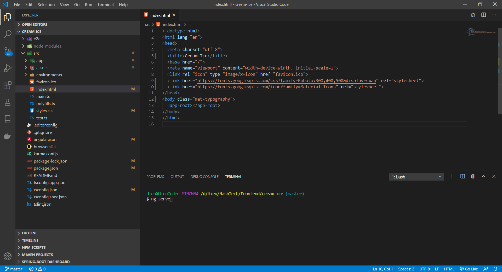

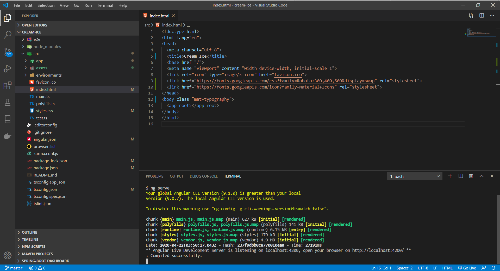

Finally, from your browser, navigate to http://127.0.0.1:4200, log in using "hieu" as both the username and password.

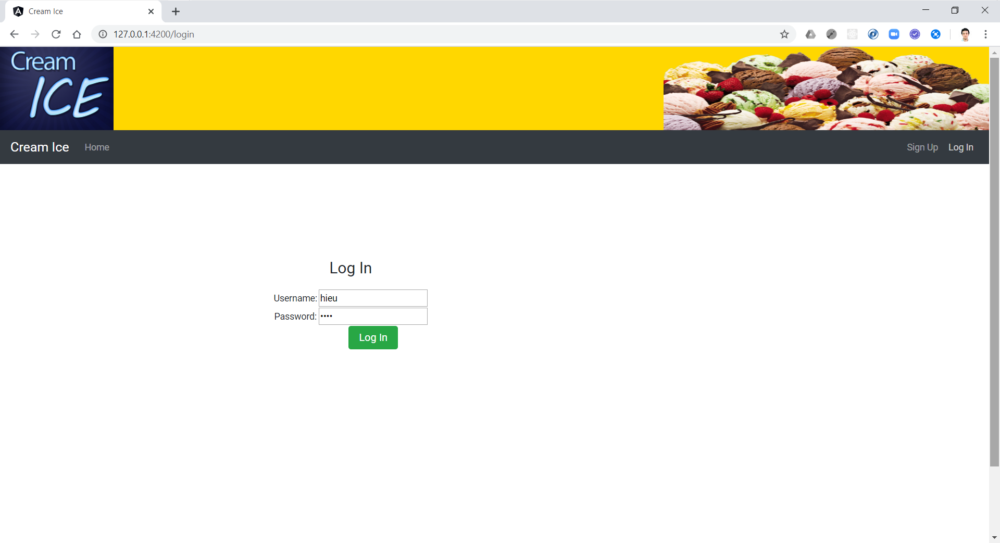

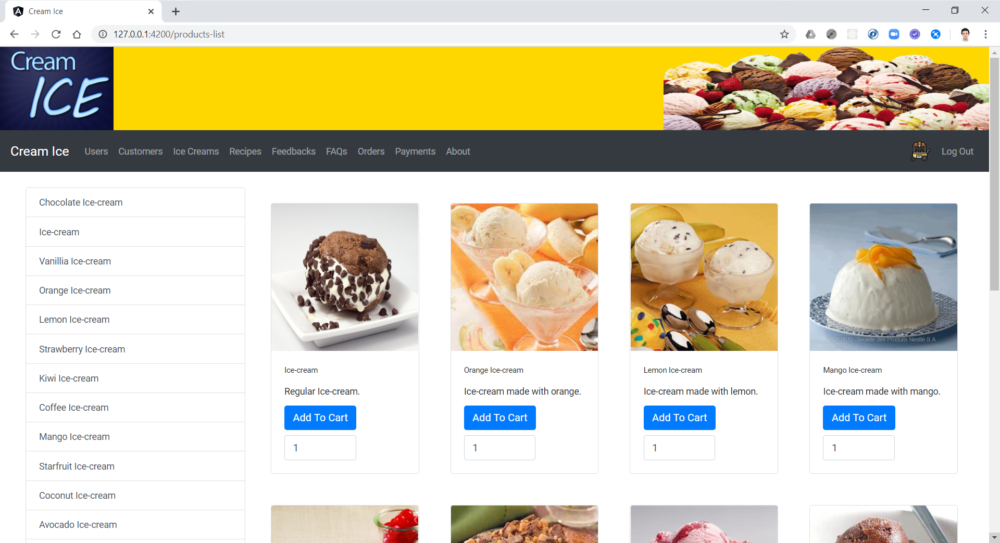